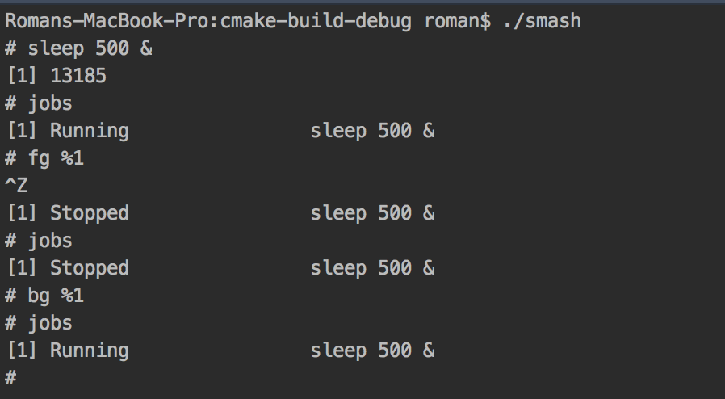

# MMN 12 - Operating Systems
Roman Smirnov.

Smash is a basic shell implementation with some concurrency capabilities (bg, fg, etc).

I've implemented the "jobs", "fg", "bg" commands. 

### Demo

### Q1 - What's an unsafe state?

We define an unsafe state as a state in which there is no _guaranteed_ scheduling to avoid a deadlock.

##### Example (p.451):
| state | has  | max  |
| ----- | ---- | ---- |
| A     | 4    | 9    |
| B     | 2    | 4    |
| C     | 2    | 7    |
where _free = 2_. The state is not a deadlock because further resource allocation is possible, 
there is also no scheduling sequence to guarantee completion - so it's an unsafe state.   

### Q2 - What's locality of reference?
Locality of reference means the process references only a fraction of its overall memory footprint at any given time.
RAM is cached in spatially near chunks. So calling near-by address retrieves the content from the cache (low latency), while distant
address calls require retrieving the content from the RAM (high latency).

##### Example (from wikipedia):
Iterating over the columns of a matrix (inner index of a 2d array) is faster then iterating over the rows (outer index)
because the inner elements are located at consecutive memory addresses and therefore require less slow loads from RAM. 

### Q3.a - When does thrashing occur?
Trashing occurs when the cache is too small in comparison to the required span of reference address, or more likely 
there's a code design fault (or maybe some necessity) which leads to frequent and consecutive non-local memory calls. 

### Q3.b - How to deal with thrashing? 
Trashing usually manifests as an abnormally high main memory access rate and CPU utilization. 
Sometimes a cache size increase might help (it's a trade-off with latency). More likely, the program should be re-written
to minimize non-local consecutive memory access.

